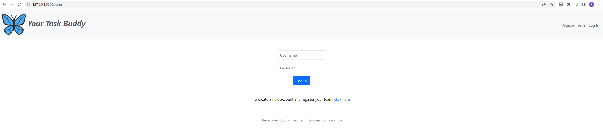
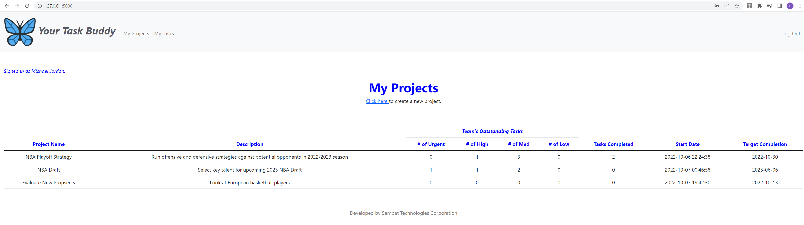
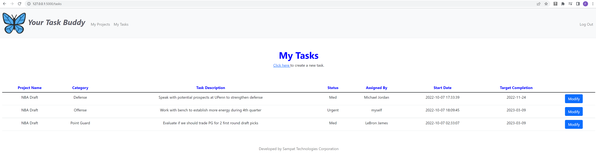
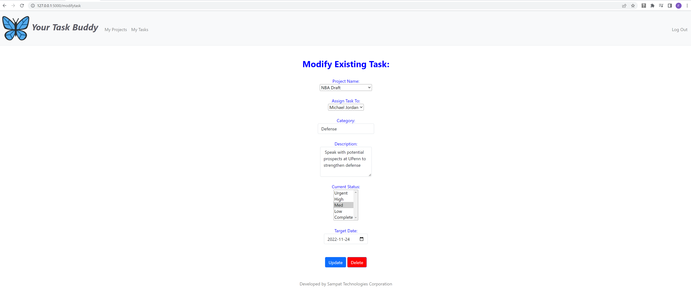

# Your Task Buddy
#### Description:
Your Task Buddy is a light weight web application that uses Python, Jinja, Flask, SQL, and HTML to help teams create, distribute, and manage tasks to support the completion of their projects.

Users can register their team and team members in a 2 step process. First, the user is asked to provide information about the team and then is prompted to provide information about each team member.  Upon completion, each team member will be able to login to the web application at the main page.  The main page will show which user is logged in.

Once logged into the platform, users will have their current projects summarized to them so they can keep track of their team's progress.  Users can create a new project by following the link on the main page.

Users are are also able to view their tasks, which is summarized for them by project and category.  Users can modify their tasks, where current information about the task will be pre-populated so updates are seamless.  Users can reassign tasks to other team members, make any changes to the task, and also delete the task entirely.

taskbuddy.db is the database for the web application, which contains 4 tables to support data for this web application.  First, is the "users" table, which contains a record of all users who have registered on the web application.  Second, is "groups" which contains a mapping of all users to groups using their unique ids.  The "projects" and "tasks" tables keep track of all project and task related information respectively.

app.py is the controller for the web application which contains all the logic to perform the features described.  Once HTML pages are visited, functions within app.py are invoked using the GET and POST request functions, where information may be extracted into the controller for processing.  Depending on the page, information from the database will be retrieved to populate specific information to the user, including their name, project details, and task details.  The database is also updated based on the actions the user takes like creating a new team, project, or modifying/creating a task.

All HTML pages can be found in the templates folder and static images like the product logo and css files can be found in the static folder.  Forms are used to POST data to the controller and information is displayed to the pages via Jinja templates. 

The web application was created so that it would be easy to use and built upon by those who wish to leverage it for custom applications.  

Future enhancements for this web application include: independent team member registration, updating user profiles, email notification to users when a task is assigned to them by another user and also the ability to modify or delete projects.  These have been left for future releases.


## Screenshots

Login Page:


Projects:


Tasks:


Modify a task:



## Deployment

To deploy this tool run

```bash
  run flask 
```

